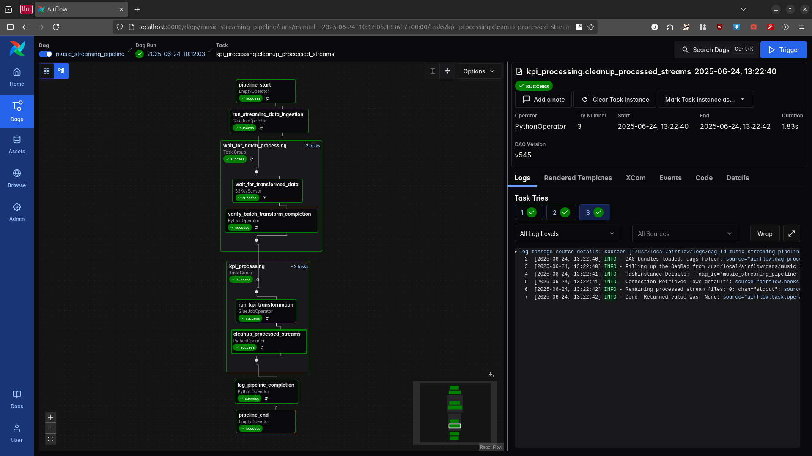
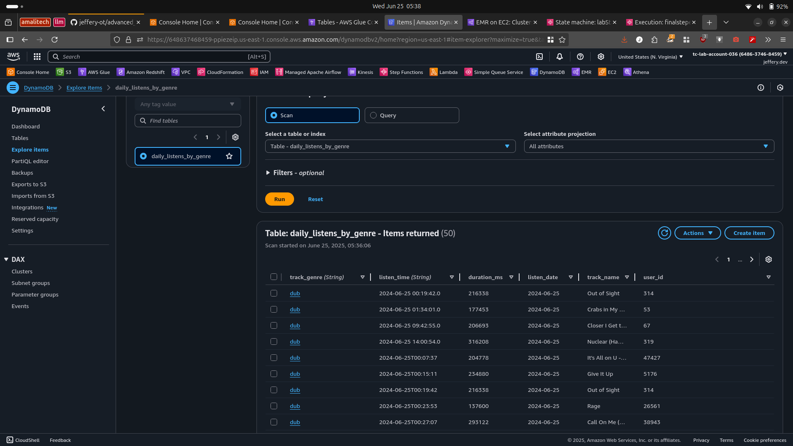

## ETl with S3, Dynamodb and Glue


#### Data Architecture

](misc/data_architecture.drawio.png)

#### Airflow Dag




### Dynamodb




Perfect — now that you’ve provided the full pipeline, including the `kpi_transformation` Glue job, here is a **production-ready `README.md`** that documents the entire **AWS-based Music Streaming ETL Pipeline**.

---

## Music Streaming ETL Pipeline

This project implements a scalable, serverless data pipeline for processing, transforming, and serving user streaming activity using AWS services.

---

###  Architecture Overview

The pipeline consists of three main phases:

1. **Data Ingestion**

   * Raw CSV and streaming logs are placed in the `lab3-raw` S3 bucket.
   * Streaming data is processed into parquet format via AWS Glue.

2. **Batch Transformation**

   * A Lambda function detects new streaming data and triggers the `batch_transform` Glue job.
   * This job joins user, song, and stream datasets and produces curated output in S3.

3. **KPI Transformation**

   * The `kpi_transformation` Glue job filters, validates, and aggregates clean data.
   * Outputs are written to S3 and optionally to DynamoDB for analytics.

---

###  Technologies Used

* **AWS Glue** (ETL orchestration & transformation)
* **Amazon S3** (data lake storage)
* **Amazon DynamoDB** (optional KPI serving)
* **AWS Lambda** (event-driven triggers)
* **Apache Spark (via PySpark)** (data processing)
* **Apache Airflow** (optional orchestration via DAG)

---

###  S3 Bucket Structure

```
lab3-raw/
├── users/users.csv
├── songs/songs.csv
├── processed-streams/         ← Parquet files from streaming ingestion
│   └── *.parquet
├── bad-records/               ← Captures malformed CSV rows
└── archives/                  ← Archived stream files

lab3-curated/
├── transformed-data/latest/   ← Output from `batch_transform`
└── transformed-data/archive/  ← Archived transformed data

lab3-presentation-data/
├── daily_listens/             ← Output from `kpi_transformation`
└── logs/validation_metrics.csv
```

---

### Components

#### 1. Lambda Trigger (`lambda_handler`)

* Scans `s3://lab3-raw/processed-streams/`
* If files are present, triggers the Glue job `batch_transform`

#### 2. `batch_transform` Glue Job

* Reads:

  * `users.csv`, `songs.csv` (CSV)
  * `processed-streams/` (Parquet)
* Validates required columns
* Joins users, songs, and stream data
* Writes to `lab3-curated/transformed-data/latest/`
* Archives processed streams to `lab3-raw/archives/`

#### 3. `kpi_transformation` Glue Job

* Reads from `lab3-curated/transformed-data/latest/`
* Casts, filters, and validates fields
* Writes partitioned output by `listen_date` to `lab3-presentation-data/daily_listens/`
* Archives `latest/` data to `transformed-data/archive/`
* Logs row-level validation metrics to `validation_metrics.csv`
* *(Optional)* Writes to DynamoDB table `daily_listens_by_genre`

#### 4. Airflow DAG (Optional: `music_streaming_pipeline`)

* Orchestrates the pipeline with retry logic
* Can manage multiple Glue job executions and Lambdas

---

### Validation Logic

Validation rules in `kpi_transformation`:

* `user_id`, `track_name`, `track_genre`, `listen_time`, `listen_date` must be non-null
* `duration_ms > 0`
* Rows failing validation are dropped
* Metrics are logged to S3

---

###  Deployment & Usage

#### Deploy Lambda

* Upload the Lambda code to AWS Lambda
* Configure necessary IAM roles and add S3 trigger on `lab3-raw/processed-streams/`

#### Run Glue Jobs

* Upload the ETL scripts to Glue
* Set up jobs:

  * `batch_transform`
  * `kpi_transformation`

#### Trigger Pipeline

* Upload new parquet files to `lab3-raw/processed-streams/`
* Lambda triggers the pipeline automatically

---

###  Notes

* `bad-records/` folder collects CSV rows that fail schema parsing during ingest.
* Partitioning in output (e.g., by `listen_date`) enables cost-efficient querying.
* Archive logic in both Glue jobs ensures idempotency and data traceability.

---

###  Testing

You can manually test the pipeline via:

```bash
# Trigger Lambda manually (AWS Console / SDK)
# Or run Glue job directly with args:
aws glue start-job-run --job-name batch_transform

# Run Glue job locally (Dev endpoint)
spark-submit batch_transform.py --step transform
```

---

### Folder Layout (Source Code)

```
├── lambda_trigger.py
├── batch_transform.py
├── kpi_transformation.py
├── dags/
│   └── music_streaming_pipeline.py
└── README.md
```

---

Let me know if you'd like this exported as a markdown file, or if you need Terraform/CDK setup for this pipeline.
