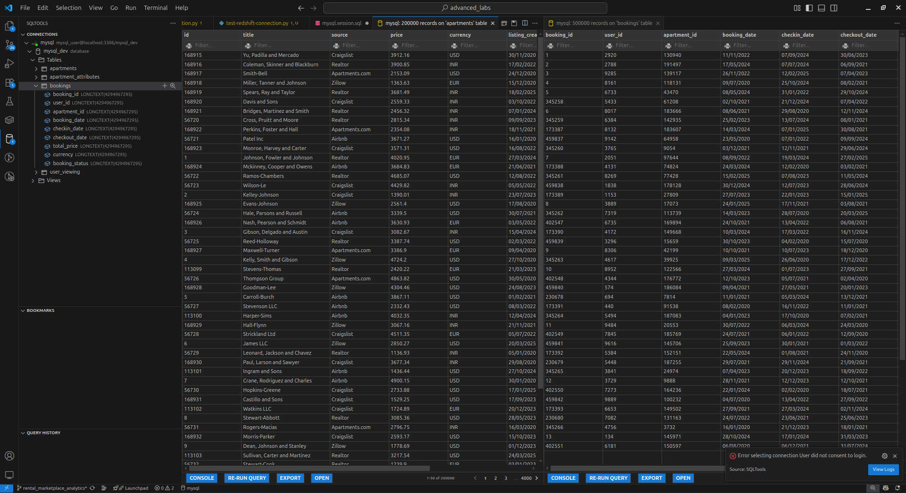

# Batch Data Processing for Rental Marketplace Analytics

## Overview

This project implements a **batch ETL pipeline** for a rental marketplace platform, leveraging AWS services and Spark to process data from a MySQL source through Amazon S3 into Amazon Redshift, organized into a multi-layer architecture (Raw, Curated, Presentation). The final output is a set of business intelligence metrics for rental performance and user engagement.

---

## Architecture Diagram (Whiteboarding)

1. **Data Source**:  MySQL (application database)
2. **Extraction Layer**: AWS Glue Job `dataingestion.py` reads from Mysql, writes raw Parquet to S3
3. **Transformation Layer (Curated)**: AWS Glue Job `curated_job.py` (or Dockerized Spark) reads raw Parquet, applies cleansing & typing, writes curated Parquet to S3
4. **Presentation Layer (KPI)**: AWS Glue Job `kpi_job.py` loads curated data, computes metrics, and writes tables to Redshift using IAM JDBC
5. **Orchestration**: AWS Step Functions state machine orchestrates these three jobs in sequence




---

## Components and Steps Taken

### 1. Extraction (AWS Glue)

* **Script**: `dataingestion.py`
* **Purpose**: Extract raw data from MySQL, cast types & clean, write Parquet to S3 (`lab2-extractiondata/raw/`)
* **Key logic**:

  * Read via JDBC from `mysql-5.7`
  * Cast columns (dates, numeric, boolean)
  * `.dropna()` rows to ensure quality

### 2. Curated Processing (AWS Glue)

* **Script**: `curated_job.py`
* **Purpose**: Read raw Parquet (`lab2-extractiondata/raw/`), compute transformed tables, write curated Parquet to S3 (`lab2-redshiftdata/curated/`)
* **Key transforms**:

  * `weekofyear`, `year`, `month` derivations
  * Joins and aggregates for occupancy, popular locations, etc.

### 3. KPI Computation & Load (AWS Glue)

* **Script**: `kpi_job.py`
* **Purpose**: Read curated Parquet (`lab2-redshiftdata/curated/`), compute business metrics, and overwrite tables in Redshift Presentation layer via IAM JDBC
* **Key operations**:

  * Generate DDL with `generate_ddl()` helper
  * Use `.mode("overwrite")` for simplicity
  * Tables loaded into `presentation` schema in Redshift

### 4. Orchestration (AWS Step Functions)

* **State Machine**:

  1. **Start**
  2. **Run Glue Job** `dataingestion.py`
  3. **Run Glue Job** `kpi_job.py`
  4. **End**

*All steps are configured with appropriate IAM roles and retry policies.*


---

## AWS Resources

* **AWS Glue**: Three jobs (`dataingestion.py`, `curated_job.py`, `kpi_job.py`)
* **Amazon S3**: Buckets `lab2-extractiondata` (raw), `lab2-redshiftdata` (curated & presentation)
* **Amazon Redshift Serverless**:

  * Workgroup: `default-workgroup`
  * Namespace: `redshift-lab`
  * Schema: `presentation` (must be created beforehand)
* **IAM Role**: `arn:aws:iam::648637468459:role/lab1-gluerole` with policies for Glue, S3, Redshift access
* **Step Functions**: Orchestrates Glue jobs end-to-end

---

## Running the Pipeline

1. **Create `presentation` schema** in Redshift (one-time):

   ```sql
   CREATE SCHEMA IF NOT EXISTS presentation;
   ```

2. **Execute Step Functions** via AWS Console or CLI:

   ```bash
   aws stepfunctions start-execution --state-machine-arn <your-state-machine-arn>
   ```

3. **Monitor** in Step Functions console and CloudWatch logs for each Glue job.

4. **Validate** metrics in Redshift:

   ```sql
   SELECT * FROM presentation.avg_listing_price LIMIT 10;
   ```

---

## Examples of KPI's


## Troubleshooting

* **`presentation` schema missing**: Run `CREATE SCHEMA` before executing KPI job.
* **IAM errors**: Ensure Step Functions execution role and Glue jobs assume `lab1-gluerole` with RedshiftServerless permissions.
* **JDBC warnings**: `Requested isolation level 1` can be ignored or suppressed via log configuration.

---

## Conclusion

This solution demonstrates an efficient, serverless batch ETL pipeline on AWS, using Glue, Step Functions, S3, and Redshift Serverless, to deliver critical rental marketplace metrics.


